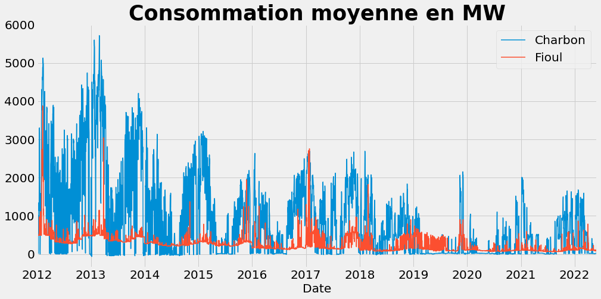

Moyenne des sources d'éléctricité 
==================================

Dans cette partie, nous allons faire la documentation du code ``moyenne_autres_sources.py``.

But du code
------------

Ce code nous donne la consommation moyenne, par jour depuis 2012, des différentes sources d'électricité en France.
Nous avons créé ce code dans le but de nous donner un modèle global de l'usage des différentes sources d'électricité.

Explication du code en généralité
----------------------------------

Dans un pemier temps, il nous faut importer les données présentes au lien suivant : https://odre.opendatasoft.com/explore/dataset/eco2mix-national-cons-def/download/?format=csv&timezone=Europe/Berlin&lang=fr&use_labels_for_header=true&csv_separator=%3B .
Suite à ça, on a créé trois dataframes contenant chacun les données pour les différentes sources d'énergie.

Dans un second temps, nous avons ré-indéxé les dataframes selon la date, et nous les avons réordonnés selon cette dernière. 
Après ça, nous avons simplement calculé la moyenne selon les dates et affiché nos résultats. 

Exemple de résultats obtenus :
-------------------------------

Ci-dessous, vous pouvez voir un exemple des résultats obtenus avec notre programme :

Ce graphique représente la consommation moyenne en Charbon et en Fioul en France depuis 2012.

Documentation de quelques commandes
------------------------------------

.. code:: python

    pd.read_csv()

permet de lire un fichier csv et de le mettre sous forme de dataframe

.. code:: python

    dataframe.dropna()

permet de nettoyer le jeu de données

.. code:: python

    pd.to_datetime()

permet de convertir une colonne en objet de type 'datetime'

.. code:: python

    dataframe.set_index()

permet de ré-indéxer le dataframe selon une colonne choisie

.. code:: python

    dataframe.resample()

permet de réordonner le dataframe selon l'index de type datetime

.. code:: python

    dataframe.mean()

permet de calculer la moyenne 

Pour plus d'informations sur ces différentes fonctions et leur utilisation vous pouvez consulter le lien suivant : https://pandas.pydata.org/docs/user_guide/index.html .
