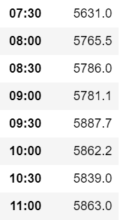
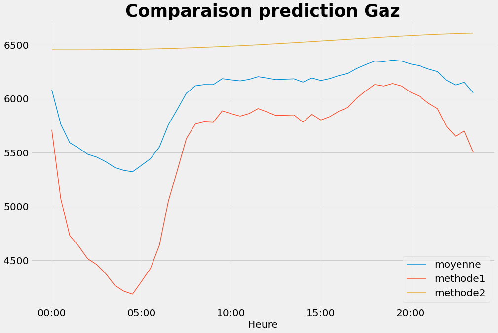
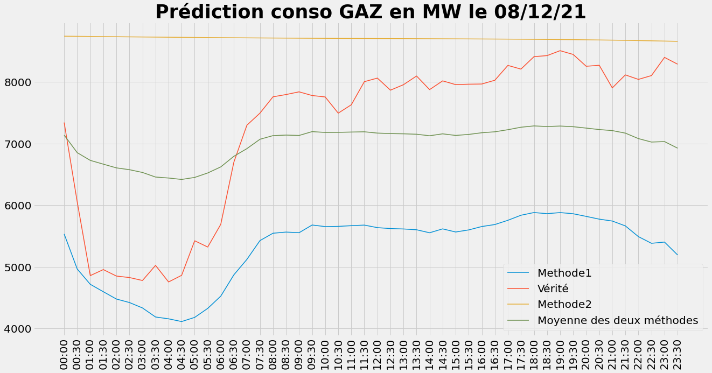

Prédiction des sources d'électricité 
=====================================

Dans cette partie, nous allons faire la documentation du code ``pred_sources.py``.

But du code
------------

Ce code a pour but de prédire la consommation électrique produite par différentes sources d'énergie au jour du 8 décembre 2022.

Explication du code en généralité
-----------------------------------

Dans un pemier temps, il nous faut importer les données présentes au lien suivant : https://odre.opendatasoft.com/explore/dataset/eco2mix-national-cons-def/download/?format=csv&timezone=Europe/Berlin&lang=fr&use_labels_for_header=true&csv_separator=%3B .
Après ça, nous avons choisi la colonne 'Date' comme index afin de récupérer seulement les données du 8 décembre de chaque année disponible.
*En effet, nous avons fait le choix de faire notre prédiction selon l'estimateur de l'espérance. Il nous faut donc calculer la moyenne empirique.*

Nous avons par la suite créé des 'sous-data' qui contiendront chacun les données des différentes sources d'énergie et les heures.
Nous avons fait le choix de placer, l'éolien, l'hydraulique et le solaire dans le même dataframe car ce sont toutes des sources d'énergie dites renouvelables/propres.

Dans chaque cas, nous avons nettoyé notre jeu de données avec la commande ``data.dropna()`` et trié les valeurs selon l'axe Heure.
Nous avons ensuite calculer la moyenne empirique de chaque source en fonction des heures.

Pour finir, nous avons réalisé un plot simple afin d'afficher nos résultats sous forme de graphiques. 

Dans une deuxième partie du code, nous avons souhaité réaliser une autre prédiction selon le module Prophet et comparer les résultats obtenus avec ceux de la première méthode.
La documentation de ce module se trouve à l'adresse suivante : https://facebook.github.io/prophet/docs/quick_start.html ou dans la partie Prédiction de la consommation d'électricité en France avec Prophet. 
Nous avons affiché nos résultats obtenus dans un dataframe ainsi que les deux méthodes et leur moyenne dans un graphique simple.

Exemple de résultats obtenus :
-------------------------------

Voici un exemple des résultats obtenus avec notre code : 
Pour l'affichage graphique de la prédiction de consommation de Gaz, nous avons obtenu le résultat suivant grâce aux commandes :

.. code:: python

    plt.figure()
    Gaz = moy1.plot(color='hotpink')
    plt.title('Prédiction conso en MW le 08/12/22')
    plt.legend()

.. image:: Images/gaz1.png 
    :scale: 50%
    :align: center

Ce qui nous donne les données suivantes : 

Pour la comparaison des deux méthodes nous obtenons le graphique suivant :

Comparaison avec la vérité :
------------------------------

Afin de tester la performance de nos méthodes, nous les avons tester au jour du 08/12/2021. 

Nous obtenons alors le graphique suivant :

Création de la base de données :
---------------------------------

La partie de code suivante nous permet d'importer des données depuis un site web et de les télécharger suite à quoi nous allons les lire et les trier.

.. code:: python 

    url = "https://odre.opendatasoft.com/explore/dataset/eco2mix-national-cons-def/download/?format=csv&timezone=Europe/Berlin&lang=fr&use_labels_for_header=true&csv_separator=%3B" 
    path_target = './consommation3.csv'
    path, fname = os.path.split(path_target)
    pooch.retrieve(url, path=path, fname=fname, known_hash=None)

    # Préparation de notre jeu de données
    cons = pd.read_csv("consommation3.csv", sep=";")

    cons = cons.set_index('Date')
    #print(cons.head(10))

    data = cons.loc[["2021-12-08", "2020-12-08", "2019-12-08", "2018-12-08", "2017-12-08",
     "2016-12-08", "2015-12-08", "2014-12-08", "2013-12-08", "2012-12-08"]]

Pour créer nos sous dataframes, nous procédons de la manière suivante pour chaque source d'énergie :

.. code:: python

    data1 = data[['Heure', 'Gaz (MW)']]
    data1.dropna(inplace = True)
    data1 = data1.sort_values(by='Heure', ascending=True)
    data1.set_index('Heure', inplace=True)

Commandes pour les prédictions :
---------------------------------

Pour la prédiction basée sur la moyenne nous utilisons la commande suivante :

.. code:: python 

    moy1 = data1.groupby(["Heure"])['Gaz (MW)'].mean()

Pour la prédiction basée sur la méthode Prophet, nous utilisons les commandes suivantes :

.. code:: python

    model2 = Prophet()
    model2.fit(df3)
    f2 = model2.make_future_dataframe(periods=48*10 , freq='30min', include_history=False)
    predic1 = model2.predict(f2)
    s = predic1[['ds','yhat']]
    predic_finale1 = s[len(s)-49:479]
    predic_finale1 = predic_finale1.rename(columns={'ds' : 'Date et Heure', 'yhat' : 'Gaz(MW)'})

Pour la prédiction basée sur la moyenne des deux méthodes :

.. code:: python

    def y(a,b):
        return ((a+b)/2)
    result['Moyenne M1 et M2'] = result.apply(lambda f: y(f['D1'], f['D2']), axis=1)

Evidemment, il faut regarder le code afin de comprendre où chaque commande intervient et à quoi correspondent les objets. 

Documentation de quelques commandes :
--------------------------------------

.. code:: python

    pd.read_csv()

permet de lire un fichier csv et de le mettre sous forme de dataframe

.. code:: python

    dataframe.set_index()

permet de ré-indéxer le dataframe selon une colonne choisie

.. code:: python

    dataframe.loc()

permert de récupérer certaines lignes d'un dataframe selon l'index 

.. code:: python

    dataframe.dropna()

permet de nettoyer le jeu de données

.. code:: python

    dataframe.sort_values()

permet de trier les valeurs selon un axe

.. code:: python

    dataframe.groupby()[].mean

permet de calculer la moyenne de la colonne entre crochets selon la colonne entre parenthèses

Pour plus d'informations sur ces différentes fonctions et leur utilisation vous pouvez consulter le lien suivant : https://pandas.pydata.org/docs/user_guide/index.html .

