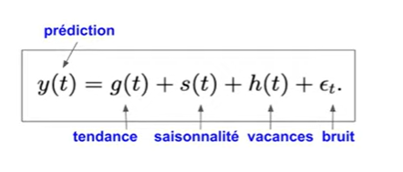
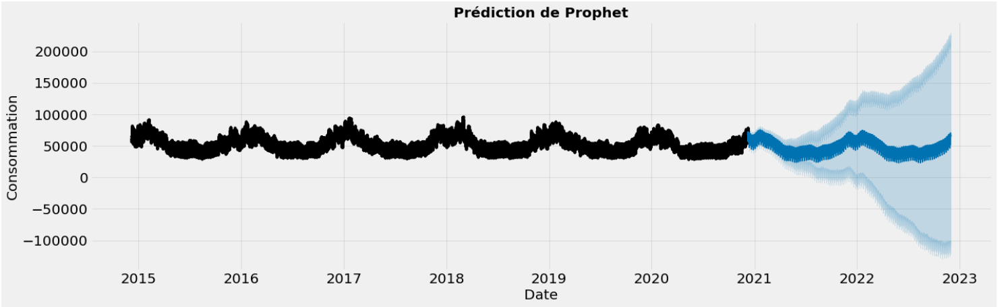
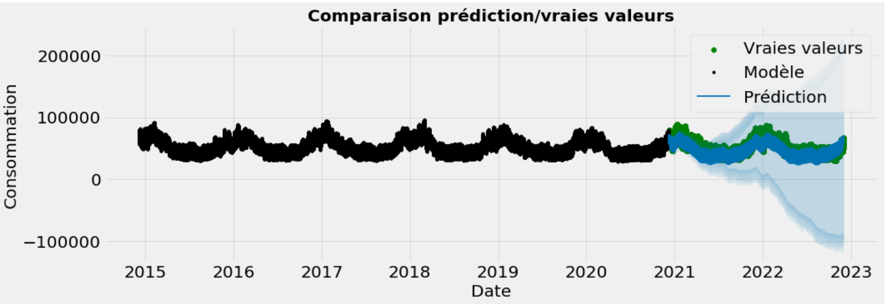
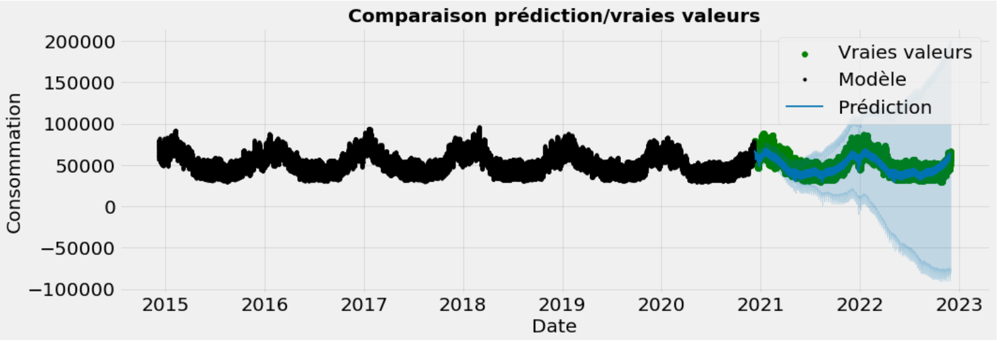

Prédiction de la consommation d'électricité en France avec Prophet :
===================================================================
Dans cette section , nous allons affectuer la documentation du code ``prediction_consommation.ipynb``

Objectif de cette section : prédir la consommation d'électricité en France pour le 08 décembre 2022 tous les quarts d'heure en contstruisant un modèle  basé sur les séries temporelles.

Petite introduction : 
-----------------------------------------------------------------

Prophet est un module Python qui permet d'effectuer des prévisions de séries temporelles basée sur un modèle additif.

Pour commencer nous allons définir quelques notions importantes :

Une série temporelle est une suite de données indexée par le temps , par exemple : 

 .. image:: Images/conso_fr.png 
    :scale: 50%
    :align: center

Modèle prophet :

avec respectivement :

Tendance : la direction générale de nos données sur une longue période : est ce qu'elle a tendance à augmenter ou diminuer ?.

Saisonnalité : fluctuation de la consommation d'électricité au cours de la semaine , journée ou de l'année .

vacances : l'effet des évènements ponctuels sur la consommation d'électricité. 

Procédure d'installation de Prophet :
-------------------------------------------------------------------
Dans un premier temps , nous allons installer ce package grâce à la commande ``pip`` suivante :

.. code:: python

    pip install prophet 

1. Création de la base de données :
---------------------------------------------------------------------
Nous allons à présent travailler avec les données de la consommation d'électricité en France du 7 décembre 2014 jusqu'au 29 novembre 2022 (par 1/2 heure) , pour celà nous allons créer deux dataframes à partir des deux url suivantes, les nettoyer , puis les concaténer :

.. _url1: https://odre.opendatasoft.com/explore/dataset/eco2mix-national-cons-def/table/?disjunctive.nature&sort=-date_heure&refine.date_heure=2015&q.timerange.date_heure=date_heure:%5B2015-12-06T23:00:00Z+TO+2022-05-31T21:59:59Z%5D
.. _url2: https://odre.opendatasoft.com/explore/dataset/eco2mix-national-tr/download/?format=csv&disjunctive.nature=true&q=date_heure:%5B2022-05-31T22:00:00Z+TO+2022-11-29T22:59:59Z%5D&timezone=Europe/Berlin&lang=fr&use_labels_for_header=true&csv_separator=%3B) 

Premier dataframe :

.. code:: python

    #Création du fichier 'consommation_elc.csv' à partit de l'url (url1 : 7 Décembre 2014 -> 31 Mai 2022 )
    import os
    import pooch
    url1 = "https://odre.opendatasoft.com/explore/dataset/eco2mix-national-cons-def/download/?format=csv&disjunctive.nature=true&q=date_heure:%5B2014-12-07T23:00:00Z+TO+2022-11-08T22:59:59Z%5D&timezone=Europe/Berlin&lang=fr&use_labels_for_header=true&csv_separator=%3B"
    path_target = './consommation_elec.csv'
    path, fname = os.path.split(path_target)
    pooch.retrieve(url1, path=path, fname=fname, known_hash=None)

.. code:: python

    # Chargement du dataset "consommation_elec.csv":
    import pandas as pd
    data = pd.read_csv("consommation_elec.csv", delimiter=";", comment="#", na_values="n/d",parse_dates=['Date et Heure'], converters={'heure' : str})

Second dataframe : 

.. code:: python 

    import os
    import pooch
    import pandas as pd 
    url2="https://odre.opendatasoft.com/explore/dataset/eco2mix-national-tr/download/?format=csv&disjunctive.nature=true&q=date_heure:%5B2022-05-31T22:00:00Z+TO+2022-11-29T22:59:59Z%5D&timezone=Europe/Berlin&lang=fr&use_labels_for_header=true&csv_separator=%3B"
    path_target = './consommation_2022.csv'
    path, fname = os.path.split(path_target)
    pooch.retrieve(url2, path=path, fname=fname, known_hash=None)
    data1 = pd.read_csv("consommation_2022.csv", delimiter=";", comment="#", na_values="n/d",parse_dates=['Date'], converters={'heure' : str})
    
2. Nettoyage des données : 
--------------------------------------------------------------------------------
Afin d'appliquer prophet , notre adataframe doit avoir une forme spécifique :

la première colonne doit porter le nom *ds* et contenir les dates (converti en objet datetime).

La deuxième colonne doit porter le nom de *y* et contenir ce que l'on veut prédire , dans notre cas la colonne *consommation*.

Premier dataframe : 

.. code:: python

    #Restriction des données sur les modalités "date et heure" et "consommation" 
    dfr = data.copy()
    dfr = data[['Date et Heure', 'Consommation (MW)']]                   
    dfr = dfr.rename(columns={'Date et Heure' : 'ds', 'Consommation (MW)' : 'y'})
    dfr = dfr.dropna() #supprimer les valeurs aberrantes 
    dfr['ds'] = pd.to_datetime(dfr['ds'] , utc=True).dt.tz_localize(None)  #convertir l'objet 'ds' en datetime / supprimer timezone
    dfr = dfr.sort_values(by = 'ds', ascending = True) #ordonner la colonne 'ds'  dans l'ordre croissant
    dfr = dfr.set_index('ds') 

Second dataframe :

.. code:: python 

    #Restriction des données sur les modalités "date - heure" et "consommation" 
    dfr1 = data1.copy()
    dfr1 = data1[['Date - Heure', 'Consommation (MW)']]                   
    dfr1 = dfr1.rename(columns={'Date - Heure' : 'ds', 'Consommation (MW)' : 'y'})
    dfr1 = dfr1.dropna()
    dfr1['ds'] = pd.to_datetime(dfr1['ds'], utc=True).dt.tz_localize(None) #convertir l'objet 'ds' en datetime/ supprimer timezone
    dfr1 = dfr1.sort_values(by='ds', ascending=True) 
    dfr1 = dfr1.set_index('ds')
    dfr1 = dfr1.resample('30T').mean() #aggrégation des données (la moyenne de conso par demi-heure)

Enfin , nous allons concaténer nos dataframes :

.. code:: python

    df = pd.concat([dfr, dfr1])

Voici un apreçu de nos données :

+----------------------+-----------+
|  ds                  | y         |
+======================+===========+
| 2014-12-07 23:00:00  | 65815.0   |
+----------------------+-----------+
| 2014-12-07 23:30:00  | 64332.0   | 
+----------------------+-----------+
| 2014-12-08 00:00:00  | 61708.0   |
+----------------------+-----------+
| 2014-12-08 00:30:00  | 61292.0   |
+----------------------+-----------+
| 2014-12-08 01:00:00  | 60926.0   |
+----------------------+-----------+
| 2014-12-08 01:30:00  | 60602.0   |
+----------------------+-----------+
| 2014-12-08 02:00:00  | 58808.0   |
+----------------------+-----------+
| 2014-12-08 02:30:00  | 57848.0   |
+----------------------+-----------+
| 2014-12-08 03:00:00  | 56853.0   |
+----------------------+-----------+
| 2014-12-08 03:30:00  | 56961.0   |
+----------------------+-----------+

3. Création du modèle/test :
---------------------------------------------------------------------------------
Nous allons créer deux intervalles de la manière suivante : 

train : l'intervalle sur lequel nous allons construire notre modèle.

test : l'intervalle sur lequel nous allons tester notre modèle.

.. code:: python

    train = df.iloc[df.index < '2020-12-08']
    test = df.iloc[df.index >= '2020-12-08']

    # Visualisation train/test split :
    import matplotlib.pyplot as plt 
    fig, ax = plt.subplots(figsize=(15, 5))
    train.plot(ax=ax, label='Training Set', title='Data Train/Test Split')
    test.plot(ax=ax, label='Test Set')
    ax.axvline('2020-12-08', color='green', ls='--')
    ax.legend(['modèle', 'test'])
    plt.xlabel("Date")
    plt.ylabel("Consommation")
    plt.show()

.. image:: Images/data_train_test.png 
    :scale: 50%
    :align: center

4. Application du modèle prophet :
--------------------------------------------------------------------------
Nous allons appliquer le modèle prophet (par défaut) et le comparer à nos vraies données :

.. code:: python

    from prophet import Prophet 
    train_pr = train.reset_index()
    model = Prophet()
    model.fit(train_pr)
    #Predict on test_pr set : 
    test_pr = test.reset_index()
    test_frc = model.predict(test_pr)

Nous allons visualiser notre prédiction :

Nous allons ensuite le comparer à nos données :

5. Impact des évènements sur nos prévisions :
---------------------------------------------------------
Afin de savoir si les "évènements" on un effet sur la consommation de l'électricité nous allons charger la base de données des jours fériés en France et les rajouter comme nouvelles composantes à notre modèle: 

.. code:: python

    model_vac = Prophet(daily_seasonality = False)
    model_vac.add_country_holidays(country_name='FR')
    model_vac.fit(train_pr)
    frc_hol = model_vac.predict(test_pr)

Nous allons ensuite comparer la prédiction à l'aide de ce modèle avec les vraies données :

\

Conclusion : les jours fériés n'ont pas un énorme impact sur notre prédiction, nous allons reprendre le modèle initial et l'utiliser pour faire nos prévisions. 

6. Application du modèle à notre jeu de données:
----------------------------------------------------------------
Nous allons ensuite effectuer un test sur nos données et prédire 10 jour à partir du 29 novembre (on multiplie 10*96 car il y a 96 quarts d'heure dans une journée ):

.. code:: python

    from prophet import Prophet  
    m = Prophet()
    m.fit(df_cons)
    f = model.make_future_dataframe(periods=10*48 , freq='30min', include_history=False)
    predic = model.predict(f) 

nous avons injecté nos données au modèle ``Prophet()`` puis utilisé la fonction ``model.make_future_dataframe()`` qui prend en entrée :

periods :  la période à laquelle on veut prédire  

freq : la fréquence pour laquelle on veut prédire : 'day','year','month','30min','H' etc.

include_history : un objet de type booléen pour inclure les dates historiques dans les données (ce qui ne nous intéresse pas particulièrement).

Cette méthode va attribuer à chaque ligne du dataframe *forecast* une valeur prédite nommée *yhat* , ainsi qu'un intervalle de confiance à 95% [yhat_lower, yhat_upper].

Après avoir sélectionné les colonnes *ds* , *yhat*, *yhat_lower* et *yhat_upper* du nouveau dataframe nous obtenons:

+---+---------------------+--------------+---------------+---------------+
|   |    ds	              |   yhat	     |  yhat_lower	 |    yhat_upper |
+===+=====================+==============+===============+===============+
| 0	| 2022-11-29 23:00:00 |	63209.474169 |	57911.827218 |	68748.699825 |
+---+---------------------+--------------+---------------+---------------+
| 1	| 2022-11-29 23:30:00 |	62437.102703 |	56609.807993 |	67873.465709 |
+---+---------------------+--------------+---------------+---------------+
| 2	| 2022-11-30 00:00:00 | 61424.199858 |	56104.315154 |	67296.256319 |
+---+---------------------+--------------+---------------+---------------+
| 3	| 2022-11-30 00:30:00 |	60204.960318 |	54409.729332 |	65720.845764 |
+---+---------------------+--------------+---------------+---------------+
| 4	| 2022-11-30 01:00:00 |	58886.317194 |	53382.007841 |	64160.205611 |
+---+---------------------+--------------+---------------+---------------+
| ..|	 ...	          |       ...    |	        ...	 |          ...  |
+---+---------------------+--------------+---------------+---------------+
|475| 2022-12-09 20:30:00 |	64454.701841 |	58979.776946 |	69840.292604 |
+---+---------------------+--------------+---------------+---------------+
|476| 2022-12-09 21:00:00 |	63793.633023 |	58620.034649 |	69211.307600 |
+---+---------------------+--------------+---------------+---------------+
|477| 2022-12-09 21:30:00 |	63217.239533 |	57565.315718 |	68875.188484 |
+---+---------------------+--------------+---------------+---------------+
|478| 2022-12-09 22:00:00 |	62692.163861 |	57070.872306 |	68251.789815 |
+---+---------------------+--------------+---------------+---------------+
|479| 2022-12-09 22:30:00 |	62138.959324 |	56701.752888 |	67733.019959 |
+---+---------------------+--------------+---------------+---------------+

Finalement , nous allons sélectionner les les lignes qui nous intéressent (celles qui contiennent la prédiction pour la journée du 8 décembre 2022), puis renommer les colonnes de notre nouveau dataframe:

.. code:: python

    d = dataframe[len(s)-94:434]
    predic_finale = d.rename(columns={'ds' : 'Date et heure', 'yhat' : 'Consommation (MW)', 'yhat_lower' : 'Consommation min', 'yhat_upper' : 'Consommation max'})

7. Création du fichier csv qui contient les prédictions :
-----------------------------------------------------------
.. code:: python 

    predic_finale.to_csv(path_or_buf='./prediction_8_dec.csv', sep=';')

8. Références :
----------------------------------------------------------------------------

Documentation fbProphet : https://facebook.github.io/prophet/docs/quick_start.html#python-api .

Series temporelles : https://www.programmez.com/magazine/article/quelques-bases-en-python-pour-la-prediction-de-series-temporelles.
