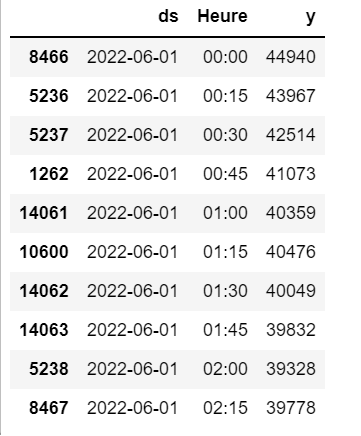

Prédiction de la consommation d'électricité en France avec Prophet :
===================================================================
Dans cette section , nous allons affectuer la documentation de la deuxième partie du code ``prediction_consommation.ipynb``

L'objectif de cette partie est similaire à celui de la partie précédente .

Petite introduction :
-----------------------------------------------------------------

Prophet est une librarie disponible sur Python (sur R également) qui permet d'effectuer des prévisions de séries temporelles basée sur un modèle additif , cet outil a été développé par Facebook dans le but de simplifier la prévision des séries temporelles. 

Dans un premier temps , nous allons installer ce package grâce à la commande ``pip`` suivante :

.. code:: python
    pip install prophet 

1. Création de la nouvelle base de données :
---------------------------------------------------------------------
Nous allons à présent travailler avec les données de la consommation d'électricité en France du 01 Juin 2022 jusqu'au 29 novembre 2022 disponibles au lien suivant : https://odre.opendatasoft.com/explore/dataset/eco2mix-national-tr/download/?format=csv&disjunctive.nature=true&q=date_heure:%5B2022-05-31T22:00:00Z+TO+2022-11-29T22:59:59Z%5D&timezone=Europe/Berlin&lang=fr&use_labels_for_header=true&csv_separator=%3B

De manière analogue à ce qui a été fait dans la section précédente , nous allons télécharger le fichier *consommation_2022.csv* à partir de l'url ci-dessus:

.. code:: python 
    import os
    import pooch
    import pandas as pd 
    url2="https://odre.opendatasoft.com/explore/dataset/eco2mix-national-tr/download/?format=csv&disjunctive.nature=true&q=date_heure:%5B2022-05-31T22:00:00Z+TO+2022-11-29T22:59:59Z%5D&timezone=Europe/Berlin&lang=fr&use_labels_for_header=true&csv_separator=%3B"
    path_target = './consommation_2022.csv'
    path, fname = os.path.split(path_target)
    pooch.retrieve(url2, path=path, fname=fname, known_hash=None)
    data1 = pd.read_csv("consommation_2022.csv", delimiter=";", comment="#", na_values="n/d",parse_dates=['Date'], converters={'heure' : str})
    
2. Nettoyage des données : 
--------------------------------------------------------------------------------
Afin d'appliquer prophet , notre adataframe doit avoir une forme spécifique :

la première colonne doit porter le nom *ds* et contenir les dates (converti en objet datetime)

La deuxième colonne doit porter le nom de *y* et contenir ce que l'on veut prédire , dans notre cas la colonne *consommation*.

.. code:: python
    import datetime 
    df2 = data1.copy()
    df2 = data1[['Date', 'Heure', 'Consommation (MW)']]                   
    df2 = df2.rename(columns={'Date' : 'ds', 'Consommation (MW)' : 'y'})
    df2 = df2.dropna() #supprimer les valeurs aberrantes 
    df2 = df2.sort_values(by=['ds','Heure'], ascending=(True,True)) #ordonner les colonnes 'ds' et 'Heure' dans l'ordre croissant
    df2['ds'] = pd.to_datetime(df2['ds']) #convertir l'objet 'ds' en datetime 

Voici un apreçu de nos données :

\

3. Application du modèle à notre jeu de données:
----------------------------------------------------------------
Nous allons ensuite effectuer un test sur nos données et prédire 10 jour à partir du 29 novembre (on multiplie 10*96 car il y a 96 quarts d'heure dans une journée ):

.. code:: python 
    m = Prophet()
    m.fit(df2)
    f = model.make_future_dataframe(periods=10*96 , freq='15min', include_history=False)
    predic = model.predict(f) 

nous avons injecté nos données au modèle ``Prophet()`` puis utiliser la fonction ``model.make_future_dataframe()`` qui prend en entrée :

periods :  la période à laquelle on veut prédire  

freq : la fréquence pour laquelle on veut prédire : 'day','year','month','30min','H' etc.

include_history : un objet de type booléen pour inclure les dates historiques dans les données (ce qui ne nous intéresse pas particulièrement).

Cette méthode va attribuer à chaque ligne du dataframe *forecast* une valeur prédite nommée *yhat*. 

Après avoir sélectionné les colonnes *ds* et *yhat* du nouveau dataframe nous obtenons:

.. image:: Images/predic.png
    :scale: 65%
    :align: center
\

Finalement , nous allons sélectionné les les lignes qui nous intéressent (celles qui contiennent la prédiction pour la journée du 8 décembre 2022)

.. code:: python
    predic_finale = s[len(s)-97:959]
    predic_finale

Nous obtenons le dataframe suivant :

.. image:: Images/predic_finale.png
    :scale: 65%
    :align: center

Création du fichier csv qui contient les prédictions :
-----------------------------------------------------------
.. code:: python 
    
    dataframe.to_csv(path_or_buf='./prediction.csv', sep=';')

